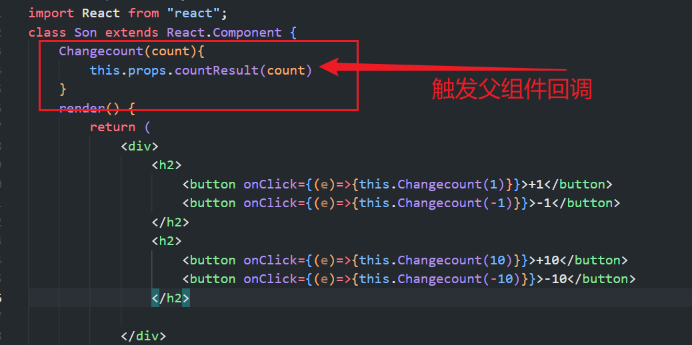

# React 
邂逅React开发（分而治之）
React的特点 – 声明式编程

声明式编程是目前整个大前端开发的模式：Vue、React、Flutter、SwiftUI； 

 它允许我们只需要维护自己的状态，当状态改变时，React可以根据最新的状态去渲染我们的UI界面

## React特点

​	组件化开发

​	多平台适配

1. 2013年，React发布之初主要是开发Web页面； 
2. 2015年，Facebook推出了ReactNative，用于开发移动端跨平台；（虽然目前Flutter非常火爆，但是还是有很多公司在使用 ReactNative）； 
3. 2017年，Facebook推出ReactVR，用于开发虚拟现实Web应用程序；（VR也会是一个火爆的应用场景）；

### React的开发依赖

开发React必须依赖三个库

1. react：包含react所必须的核心代码
2. react-dom：react渲染在不同平台所需要的核心代码
3. babel：将jsx转换成React代码的工具

为什么要进行拆分呢？原因就是react-native

react包中包含了react web和react-native所共同拥有的核心代码。 

react-dom针对web和native所完成的事情不同： ✓ web端：

react-dom会将jsx最终渲染成真实的DOM，显示在浏览器中 ✓ native端

react-dom会将jsx最终渲染成原生的控件（比如Android中的Button，iOS中的UIButton）

**cdn 引入**

计算器案例


#### 0 组件分类

React的组件相对于Vue更加的灵活和多样，按照不同的方式可以分成很多类组件：

1. 根据组件的定义方式，可以分为：

   1. **函数组件(Functional Component )**和**类组件(Class Component)；**

      

2. 根据组件内部是否有状态需要维护，可以分成：

   1. **无状态组件(Stateless Component )**和**有状态组件(Stateful Component)；**

      

3. 根据组件的不同职责，可以分成：

   1. **展示型组件(Presentational Component)**和**容器型组件(Container Component)；**

      


这些概念有很多重叠，但是他们最主要是关注数据逻辑和UI展示的分离：

​	函数组件：无状态组件、展示型组件主要关注UI的展示；

​	类组件：有状态组件、容器型组件主要关注数据逻辑

### 1.1 类组件

类组件的定义有如下要求：

```json
1. 组件的名称是大写字符开头（无论类组件还是函数组件）
2. 类组件需要继承自 React.Component
3. 类组件必须实现render函数
```

在ES6之前，可以通过create-react-class 模块来定义类组件，但是目前官网建议我们使用ES6的class类定义。

使用class定义一个组件：

​	constructor是可选的，我们通常在constructor中初始化一些数据；

​	this.state中维护的就是我们组件内部的数据；

​	render() 方法是 class 组件中唯一必须实现的方法；

```react
import  React  from 'react'
export class App extends React.Component {
    constructor(){
        super(); // 必须首先调用 super()，并传递 props
                // 在这里可以安全地使用 this 关键字
        this.state = {
            name: '李华'
        }
    }
    render(){
        return (
            <h2>className: {this.state.name}</h2>
        )
    }

}
// 调用 createRoot(domNode, options?) 以在浏览器 DOM 元素中创建根节点显示内容
// createRoot 返回一个带有两个方法的的对象，这两个方法是：render 和 unmount。
const root = createRoot(document.getElementById('root'));
root.render(
      <App/>
);
```

##### 1.1.1 **render函数**

**啥时候会被调用**

1. 第一次渲染的时候

2. 检测到this.props 和 this.state（调用this.setState()）变化的时候

render函数的返回值

当 render 被调用时，它会检查 this.props 和 this.state 的变化并返回以下类型之一：

1. React 元素：

```
通常通过 JSX 创建。
例如，<div /> 会被 React 渲染为 DOM 节点，<MyComponent /> 会被 React 渲染为自定义组件；
无论是 <div /> 还是 <MyComponent /> 均为 React 元素。
```

​		通过babel转化成React.createElement() 因此被称为react元素


2. 数组或 fragments：使得 render 方法可以返回多个元素。
3. Portals：可以渲染子节点到不同的 DOM 子树中。
4. 字符串或数值类型：它们在 DOM 中会被渲染为文本节点，比不是React元素
5. 布尔类型或 null：什么都不渲染。

### 1.2 函数组件

函数组件是使用function来进行定义的函数，

**只是这个函数会返回和类组件中render函数返回一样的内容**。

函数组件有自己的特点（当然，后面我们会讲hooks，就不一样了）。

​	没有生命周期，也会被更新并挂载，但是没有生命周期函数；

​	this关键字不能指向组件实例（因为没有组件实例）；

​	没有内部状态（state）；

我们来定义一个函数组件：


后面学习Hooks时，会针对函数式组件进行更多的学习。

​		函数组件嵌套

```js
import ReactDOM from 'react-dom/client';

// 函数式组件
const ChildComponent  = () => {
  return (
    <span>app</span>
  )
}
const App = () => 
  {
    return (
      <div>
    <h2>12311312</h2>
      <ChildComponent  />
      </div>
    )
  }
const root = ReactDOM.createRoot(document.getElementById('root'));
root.render(
  <App />
);
```

### 1.3 **组件的样式**

- 行内样式

​					想给虚拟dom添加行内样式，需要使用表达式传入样式对象的方式来实现：

```react
// 注意这里的两个括号，第一个表示我们在要JSX里插入JS了，第二个是对象的括号
<p style={{color:'red', fontSize:'14px'}}>Hello world</p>
```

- 内联样式，使用CSS文件

```react
const textStyle = {
      color: 'red',
      fontSize: '16px',
      fontWeight: 'bold',
    };
    return (
      <div>
        <h2 style={{color: 'red'}}>原来，天上的星，都是曾被人惦念而又遗忘的梦啊。</h2>
        {/* 内联样式：可以直接在组件的 JSX 中使用 style 属性来指定内联样式。样式需要以 JavaScript 对象的形式传递，属性名采用驼峰式写法，属性值为样式值。 */}
        <h3 style={textStyle}>阶砖不会拒绝磨蚀，窗花不可幽禁落霞。</h3>
        {/* 使用CSS文件：在React应用中，你也可以像普通的网页开发一样，创建一个独立的CSS文件，并在组件中引入。你可以使用className属性给元素添加类名，并在CSS文件中定义相应的样式。 */}
        <h4 className="HeLlo"> 不负韶华，不忘初心</h4>
        <ChildComponent  />
      </div>
 )
```

### 1.4 事件处理

#### 1.4.1 类组件

1 事件绑定中的this

*   在类中直接定义一个函数，并且将这个函数绑定到元素的onClick事件上，当前这个函数的this指向的是谁呢？
*   默认情况下是undefined
*   因为在正常的DOM操作中，监听点击，监听函数中的this其实是节点对象（比如说是button对象）
*   这次因为React并不是直接渲染成真实的DOM，我们所编写的button只是一个语法糖，它的本质React的Element对象；
*   那么在这里发生监听的时候，react在执行函数时并没有绑定this，默认情况下就是一个undefined

2 我们在绑定的函数中，可能想要使用当前对象，比如执行 this.setState 函数，就必须拿到当前对象的this

* 我们就需要在传入函数时，给这个函数直接绑定this

  ```react
  import React from 'react'
  export class App extends React.Component {
      constructor() {
          super(); // 必须首先调用 super()，并传递 props
                   // 在这里可以安全地使用 this 关键字
          // console.log(this) // APP实例
          this.state = {
              name: '李华'
          }
          this.editname2 = this.editname2.bind(this)
      }
      editname1(){
          console.log(this) // undefined
      }
      editname2(){
          console.log(this) // App 比如执行 this.setState 函数，就必须拿到当前对象的this
          this.setState({
              name: '李忠'
          })
      }
      render() {
          console.log(this)
          return (
              <div>
                  <h2>className: {this.state.name}</h2>
                  <button onClick={this.editname1}>editName1</button>
                  <button onClick={this.editname2}>editName2</button>
              </div>
          )
      }
  }
  ```

  电影列表案例


#### 1.4.2 函数组件 hook Component

```react
import { useState } from "react"

export function App() {
    const [name, setName] = useState('李华');

    const editname1 = () => {
        setName('李忠')
    }

    return (
        <div>
            <h2>className: {name}</h2>
            <button onClick={editname1}>editName1</button>
        </div>
    )
}
```

#### 1.4.3 **表单中的受控组件与非受控组件**

​		非受控组件将真实数据储存在 DOM 节点中，所以在使用非受控组件时，有时候反而更容易同时集

成 React 和非 React 代码。

​		如果你不介意代码美观性，**并且希望快速编写代码，使用非受控组件往往可**

**以减少你的代码量**。否则，你应该使用受控组件。

##### 	**非受控组件**

React要编写一个非受控组件，可以 使用 ref 来从 DOM 节点中获取表单数据，就是非受控组件。

​	例如，下面的代码使用非受控组件接受一个表单的值：

```react
class NameForm extends React.Component {
    constructor(props) {
        super(props);
        this.handleSubmit = this.handleSubmit.bind(this);
        this.input = React.createRef();
    }
    handleSubmit(event) {
        alert('A name was submitted: ' + this.input.current.value);
        event.preventDefault();
    }
    render() {
        return (
                <form onSubmit={this.handleSubmit}>
                    <label>
                    Name:
                    <input type="text" ref={this.input} />
                    </label>
                	<input type="submit" value="Submit" />
                </form>
        );
    }
}
```

​	**默认值**

​		在 React 渲染生命周期时，表单元素上的 value 将会覆盖 DOM 节点中的值，在非受控组件中，你经

​	常希望 React 能赋予组件一个初始值，但是不去控制后续的更新。 在这种情况下, 你可以指定一个

​	defaultValue 属性，而不是 value 。

```react
render() {
    return (
        <form onSubmit={this.handleSubmit}>
            <label>
            Name:
            <input
            defaultValue="Bob"
            type="text"
            ref={this.input} />
            </label>
            <input type="submit" value="Submit" />
        </form>
    );
}
```
```js
​		<input type="checkbox"> 和 <input type="radio"> 支持 defaultChecked 

​		同理<select>和 <textarea> 支持 defaultValue  
```

##### **受控组件**

```react
class NameForm extends React.Component {
    constructor(props) {
        super(props);
        this.state = {value: ''};
        this.handleChange = this.handleChange.bind(this);
        this.handleSubmit = this.handleSubmit.bind(this);
     }
     handleChange(event) {
        this.setState({value: event.target.value});
     }
      handleSubmit(event) {
        alert('提交的名字: ' + this.state.value);
        event.preventDefault();
     }
      render() {
        return (
          <form onSubmit={this.handleSubmit}>
            <label>
              名字:
              <input type="text" value={this.state.value} onChange={this.handleChange} 
            </label>
            <input type="submit" value="提交" />
          </form>   
          );
     }
}
```

​		由于在表单元素上设置了 value 属性，因此显示的值将始终为 this.state.value ，这使得 React 的 state 成为

​	唯一数据源。由于 handlechange 在每次按键时都会执行并更新 React 的 state，因此显示的值将随着用户输入而

​	更新。

### 1.5 Ref的应用

​		**给标签设置**ref="username"

```js
通过这个获取this.refs.usernme , ref可以获取到应用的真实dom
```

```react
class App extends Component {
    constructor() {
        super()
        this.state = {
            name: 'React',
            isLiked: false
        }
    }

    // 方法
    testa() {
        console.log(123)
        this.setState({
          name: 'Vue'  
        })
    }
    inputRef = React.createRef() // 访问this.myRef.current

    render() {
        return (
            <div>   
                    <input ref={this.inputRef}></input>
                    <button onClick={()=>{ console.log(this.inputRef.current.value)}}>get</button>
                    <h2>{this.state.name}</h2>
                    <button onClick={this.testa.bind(this)}> edit </button>
            </div>
            
        )
    }
}
```

### 1.6 **组件的数据挂载方式**

#### 状态**(state)**

状态就是组件描述某种显示情况的数据，由组件自己设置和更改，也就是说由组件自己维护，使用状态

的目的就是为了在不同的状态下使组件的显示不同(自己管理)

**(1)** **定义**state

第一种方式

```react
import React,  { Component } from "react"


class App extends Component {
     
        state = {
            name: 'React',
            isLiked: false
            }
        // 方法
        testa (){
            console.log('testa')
        }


        render (){
            return (
                <h2>{this.state.name}</h2>
            )
        }
    }

export default App;
```

第二种方式

```react
class App extends Component {
    constructor() {
        super()
        this.state = {
            name: 'React',
            isLiked: false
        }
    }

    // 方法
    testa() {
        console.log(123)
        this.setState({
          name: 'Vue'  
        })
    }


    render() {
        return (
            <div>
                    <h2>{this.state.name}</h2>
                    <button onClick={this.testa.bind(this)}> edit </button>
            </div>
            
        )
    }
}
```

this.state 是纯js对象,在vue中，data属性是利用 Object.defineProperty 处理过的，更改data的数据的时候会触发数据的getter 和 setter ，但是React中没有做这样的处理，如果直接更改的话，

react是无法得知的，所以，需要使用特殊的更改状态的方法 setState 。

**setState**

setState 有两个参数

注意： setstate 处在 同步的逻辑中， **异步更新状态**， 更新真实DOM

 	-  处在异步的逻辑中， 同步更新状态， 同步更新真实DOM
 	-  接收第二个参数， 第二个参数回调函数，状态和DOM更新完后就会被触发

例子：

better-scroll  滚动第三方库

```react
import React, { Component } from "react"
import BetterScroll from 'better-scroll'

class App extends Component {
    constructor() {
        super()
        this.state = {
            name: []
        }
    }
    const wrapper = { height: '200px', backgroundColor: 'yellow', overflow: 'hidden' }
    // 方法
    testa() {
        this.setState({
            name: [1, 2, 3, 4, 5, 6, 12312312, 7, 8, 123, 81111111111, 954, 64, 54, 45, 645]
        },
        // 第二个参数： 此处是异步，须在这里拿到数据进行渲染
         () => {
            console.log(this.state.name)
            new BetterScroll('.wrapper', {
                movable: true,
                zoom: true
            })
        }
    )
    }
    render() {
        return (
            <div>
                <button onClick={this.testa.bind(this)}> edit </button>
                <div className="wrapper">
                    <ul className="content" >
                        {
                            this.state.name.map((item) =>
                                <li key={item}>{item}</li>
                            )
                        }
                    </ul>
                </div>
            </div>
        )
    }
}
export default App;
```

#### **属性**(props)

props 是正常是外部传入的，组件内部也可以通过一些方式来初始化的设置，属性不能被组件自己更

改，但是你可以通过父组件主动重新渲染的方式来传入新的 props

类组件

```react
import React, { Component, createRef } from "react"
import PropTypes from 'prop-types';
class App extends Component {
    constructor() {
        super()
        
        this.state = {
            name: 'React',
            isLiked: false
        }
        
    }
    // 默认参数
    static defaultProps = {
         color: 'blue'
    };
    // 默认类型检验
    static propTypes = {
        color: PropTypes.string
      };
    // 方法
    testa() {
        this.setState({
          name: 'Vue'  
        })
    }

    render() {
        let { subtitle, truth, color } = this.props
        return (
          


            <div>   
                    <h2>{this.props.title}</h2>
                    <h3>{this.props.subtitle}</h3>
                    我是 { truth ? <span>真的</span> : <span>假的</span>}
                    color: {this.props.color}
            </div>
            
        )
    }
}
export default App;
```

函数组件

```react
function Avatar(props) {
  let person = props.person;
  let size = props.size;
  // ...
}
```

```jsx
// 类型检验
// 首先，确保你的项目中已经安装了prop-types包。如果没有安装，可以使用以下命令安装：
bash
npm install prop-types
// 在你的函数组件文件中引入prop-types：
// jsx
import PropTypes from 'prop-types';
// 对于你的函数组件，你可以通过给组件添加一个propTypes属性来对传入的props进行类型检验：

function MyComponent(props) {
  // ...
}

MyComponent.propTypes = {
  name: PropTypes.string.isRequired,
  age: PropTypes.number,
  isActive: PropTypes.bool,
  // 其他prop类型检验
};
```

**属性**vs**状态**

相似点：都是纯js对象，都会触发render更新，都具有确定性（状态/属性相同，结果相同）

不同点：

1. 属性能从父组件获取，状态不能
2. 属性可以由父组件修改，状态不能
3. 属性能在内部设置默认值，状态也可以，设置方式不一样
4. 属性不在组件内部修改，状态要在组件内部修改
5. 属性能设置子组件初始值，状态不可以
6. 属性可以修改子组件的值，状态不可以

state 的主要作用是用于组件保存、控制、修改自己的可变状态。 state 在组件内部初始化，可以被

组件自身修改，而外部不能访问也不能修改。你可以认为 state 是一个局部的、只能被组件自身控制

的数据源。 state 中状态可以通过 this.setState 方法进行更新， setState 会导致组件的重新渲染。


props 的主要作用是让使用该组件的父组件可以传入参数来配置该组件。它是外部传进来的配置参

数，组件内部无法控制也无法修改。除非外部组件主动传入新的 props ，否则组件的 props 永远保持

不变。


没有 state 的组件叫无状态组件（stateless component），设置了 state 的叫做有状态组件（stateful component）。

**运用：**因为状态会带来管理的复杂性，我们尽量多地写无状态组件，尽量少地写有状态的组件。这样会降低代码维护的难度，也会在一定程度上增强组件的可复用性。

### 插槽 children

```react
import React, { Children, Component, createRef } from "react"
import PropTypes from 'prop-types';
const ChildComponent = (props) => {
    return (
        <div>
            12313123
            {props.children}
        </div>
    )
}
class App extends Component {
    constructor() {
        super()
        this.state = {
            name: 'React',
           subtitle: '123'
        }
        this.editSub = this.editSub.bind(this)
    }
    // 默认参数
    static defaultProps = {
        color: 'blue'
    };
    // 默认类型检验
    static propTypes = {
        color: PropTypes.string
    };
    // 方法
    testa() {
        this.setState({
            name: 'Vue'
        })
    }
    editSub(){
        console.log(this)
        this.setState({
            subtitle: '中国'
        })
    }
    render() {
        let { subtitle, truth, color } = this.props
        return (
            <div>
                <h2>{this.props.title}</h2>
                <h3>{this.props.subtitle}</h3> <button onClick={this.editSub}>修改副标题</button>
                我是 {truth ? <span>真的</span> : <span>假的</span>}
                color: {this.props.color}
                <ChildComponent>
                        插槽内容
                </ChildComponent>
            </div>
        )
    }
}
export default App;
```

### 1.7 认识生命周期


重新认识（类和实例）


​	**每创建一个<HelloWorld/> 都会走一遍该实例（也就是constructor）**

​	很多的事物都有从创建到销毁的整个过程，这个过程称之为是**生命周期**


React组件也有自己的生命周期，了解组件的生命周期可以让我们在最合适的地方完成自己想要的功能；

​	生命周期和生命周期函数的关系：

生命周期是一个抽象的概念，在生命周期的整个过程，分成了很多个阶段；

​	比如装载阶段（Mount），组件第一次在DOM树中被渲染的过程；

​	比如更新过程（Update），组件状态发生变化，重新更新渲染的过程；

​	比如卸载过程（Unmount），组件从DOM树中被移除的过程；

React内部为了告诉我们当前处于哪些阶段，会对我们组件内部实现的某些函数进行回调，这些函数就是生命周期函数：

​	比如实现componentDidMount函数：组件已经挂载到DOM上时，就会回调；

​	比如实现componentDidUpdate函数：组件已经发生了更新时，就会回调；

​	比如实现componentWillUnmount函数：组件即将被移除时，就会回调；

我们可以在这些回调函数中编写自己的逻辑代码，来完成自己的需求功能；

我们谈React生命周期时，**主要谈的类的生命周期**

因为函数式组件是没有生命周期函数的；（后面我们可以通过hooks来模拟一些生命周期的回调）

#### 1.7.1 生命周期解析


对Mounting进行解析


从打印结果知，该顺序由此证明

###### **Constructor**

​	如果不初始化 state 或不进行方法绑定，则不需要为 React 组件实现构造函数。

constructor中通常只做两件事情：

通过给 this.state 赋值对象来初始化内部的state；

为事件绑定实例（this）


###### componentDidMount

**componentDidMount() 会在组件挂载后（插入 DOM 树中）立即调用。**

componentDidMount中通常进行哪里操作呢？

依赖于DOM的操作可以在这里进行；

​	**在此处发送网络请求就最好的地方；（官方建议）**

​	**可以在此处添加一些订阅（会在componentWillUnmount取消订阅）**


###### componentDidUpdate

**componentDidUpdate() 会在更新后会被立即调用，首次渲染不会执行此方法。**

当组件更新后，可以在此处对 DOM 进行操作；

如果你对更新前后的 props 进行了比较，也可以选择在此处进行网络请求；（例如，**当 props 未发生变化时，则不会执行网络请求**）。


###### componentWillUnmount

**componentWillUnmount() 会在组件卸载及销毁之前直接调用。**

在此方法中执行必要的清理操作；

例如，清除 timer，取消网络请求或清除在 componentDidMount() 中创建的订阅等；

案例


#### 1.7.2 不常用生命周期函数

除了上面介绍的生命周期函数之外，还有一些不常用的生命周期函数：


getDerivedStateFromProps：state 的值在任何时候都依赖于 props时使用；该方法返回一个对象来更新state；

getSnapshotBeforeUpdate：在React更新DOM之前回调的一个函数，可以获取DOM更新前的一些信息（比如说滚动位置）；

shouldComponentUpdate：该生命周期函数很常用，但是我们等待讲**性能优化**时再来详细讲解；

另外，React中还提供了一些过期的生命周期函数，这些函数已经不推荐使用。
更详细的生命周期相关的内容，可以参考官网：https://zh-hans.reactjs.org/docs/react-component.html

##### 关于生命周期的性能优化

**react**中性能优化的方案

**1. shouldComponentUpdate**

控制组件自身或者子组件是否需要更新，尤其在子组件非常多的情况下， 需要进行优化

**2. PureComponent**

PureComponent会帮你 比较新props 跟 旧的props， 新的state和老的state（值相等,或者

对象含有相同的属性、且属性值相等 ），决定shouldcomponentUpdate 返回true 或者

false， 从而决定要不要呼叫 render function。

注意：

如果你的 state 或 props 『永远都会变』，那 PureComponent 并不会比较快，因为

 shallowEqual 也需要花时间。

### 1.8 认识组件间的通信

总结：

1. 父子嵌套关系：利用 props 对象实现父组件向子组件通信；
2. 父子嵌套关系：利用 callback(回调函数) 实现子组件向父组件通信；
3. 多层(父子)嵌套关系(跨级通信)：利用 Context 对象, 以生产者和消费者的方式实现通信;
4. 非嵌套关系：利用 events (发布订阅) 的方式实现通信;

父组件在展示子组件，可能会传递一些数据给子组件：

​      父组件通过 **属性=值** 的形式来传递给子组件数据；

​     子组件通过 **props** 参数获取父组件传递过来的数据；（内部做了一个this.prop = xxx ）操作

##### 参数propTypes

​	对于传递给子组件的数据，有时候我们可能希望进行验证，特别是对于大型项目来说：

当然，如果你项目中默认继承了Flow或者TypeScript，那么直接就可以进行类型验证；

但是，即使我们没有使用Flow或者TypeScript，也可以通过 prop-types 库来进行参数验证；

从 React v15.5 开始，React.PropTypes 已移入另一个包中：prop-types 库

​	更多的验证方式，可以参考官网：https://zh-hans.reactjs.org/docs/typechecking-with-proptypes.html

比如验证数组，并且数组中包含哪些元素；

比如验证对象，并且对象中包含哪些key以及value是什么类型；

比如某个原生是必须的，使用 requiredFunc: PropTypes.func.isRequired

如果没有传递，我们希望有默认值呢？
	我们使用defaultProps就可以了

以前的写法：


如今的写法：


##### 子传父



